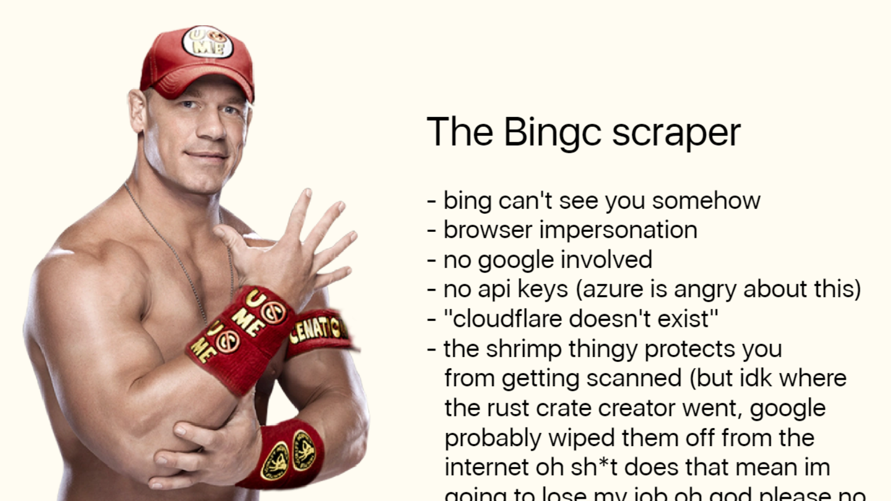

# bingc(hillin)
Bing search scraper written in 🐍 Python™️®️ (🔥🔥🔥).

Why?

- **Extremely lightweight**. Bingc is based on `selectolax` for HTML parsing and `primp` for HTTP request browser impersonation that's based on `rquest`.
- **Ultra fast & robust**. While Bingc is written in Python, we carefully selected those two dependencies to smooth out everything: one is written in Rust and the other is written in C (w/ CPython).
- **Strongly typed**. Bingc is typed everywhere and has a clean, idiomatic API.
- **Asynchronous support**. Functions begin with the letter `a` is wrapped with `asyncify`.
- **John Cena**. You can't see me (on PyPi, probably).


Bingc APIs are organized by their API category. For example, if you'd like to fetch the latest news from Bing from [this page](https://www.bing.com/news) (where there's no query parameters), we call it `landing`. Therefore, to use the `news()` call, you'd do:

```python
from bingc import landing

# Get latest news
landing.news()

# Get search suggestions (q is optional)
landing.suggest(q="why.")
```

<details>
<summary><b>Example output (latest news)</b></summary>

```python
NewsLanding(
    headlines=[
        NewsCard(
            title="Walter White just got a new job",
            snippet="Former chemistry expert Walter White has just joined the team of his ...",
            url="https://www.msn.com/en-us/news/walter-white-just-got-a-new-job/ar-BBp2X9N?ocid=ntnnews",
            source="The Watermelon Post",
            timestamp="48m",
            color="#271B1B",
            image="https://www.bing.com/th?id=OVFT.Hfvt51RL2ECN_oovdUhW-S&pid=News&w=308&h=178&c=14&rs=2&qlt=30",
        ),
        ...,
    ],
    trending=[
        NewsArticle(
            title="Walter White's secret service mission fails",
            snippet=None,
            url='/news/topicview?q=Walter+...',
            image="/th?id=...A&rs=2&qlt=80&pid=1.11&w=154&h=77&c=7&rs=2&qlt=30",
        ),
        ...,
    ]
)
```

</details>

<details>
<summary><b>Example output (search suggestions)</b></summary>

```python
[
    Suggestion(
        t="MB",
        query="why don't we",
        url="/search?q=why+don%27t+we&filters=ufn...",
        ext=Extension(
            query="**Why Don't We*",
            description="American boy band",
            image="/th?id=OSK.d4574222b4ff755acf606e180a6cbf2d&w=120&h=120&qlt=90&c=6&rs=1&cdv=1&pid=RS",
        ),
    ),
    Suggestion(
        t="AS",
        query="**why is the sky blue*",
        url="/search?q=why+is+the+sky+blue&qs=AS...",
        ext=None,
    ),
    ...
]
```

</details>

<br />

Take a look at the graph:



> **Conventions**
> 
> Don't mass-request the same endpoint. There's a huge chance of you getting IP blocked, permanently or otherwise.
